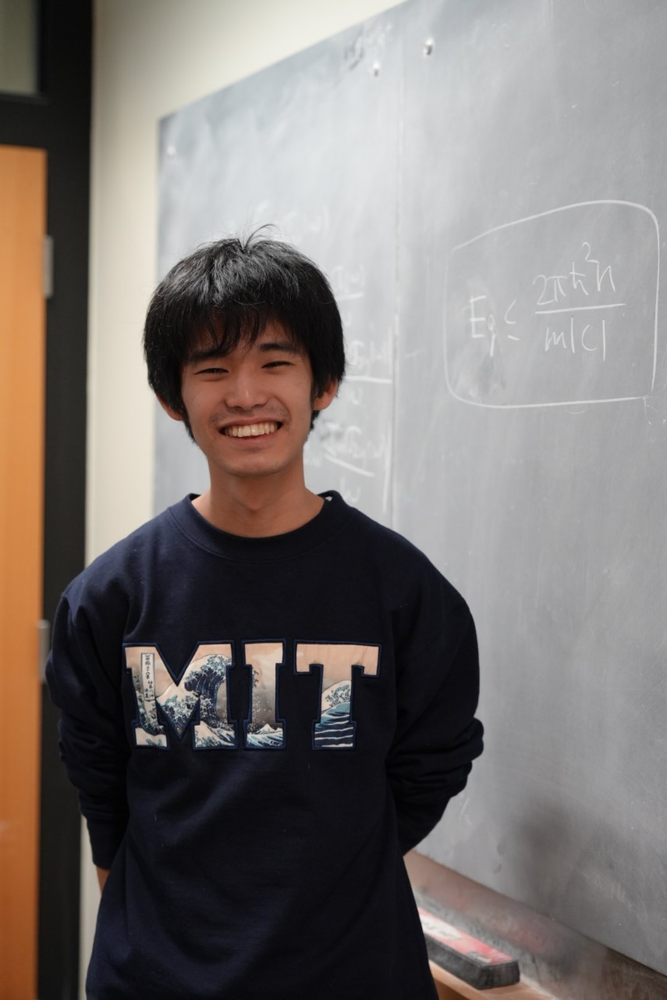

This is Yugo Onishi's homepage. 

Yugo Onishi   （大西 由吾）
=====
* PhD Student. Condensed Matter Theory group, MIT Physics
* Current Supervisor: Professor Liang Fu
* Office: [8-301](https://whereis.mit.edu/?go=8), MIT
* Email: yugo0o24_at_mit.edu   (please replace _at_ with @)
* Recent preprints: [arXiv](https://arxiv.org/search/?query=Onishi%2C+Yugo&searchtype=author&abstracts=show&order=-announced_date_first&size=50)
* Publications: See [Publications](https://yugoonishi.github.io/publications/)

Research Interests
=====
Topology and quantum geometry in condensed matter and its relation to responses
